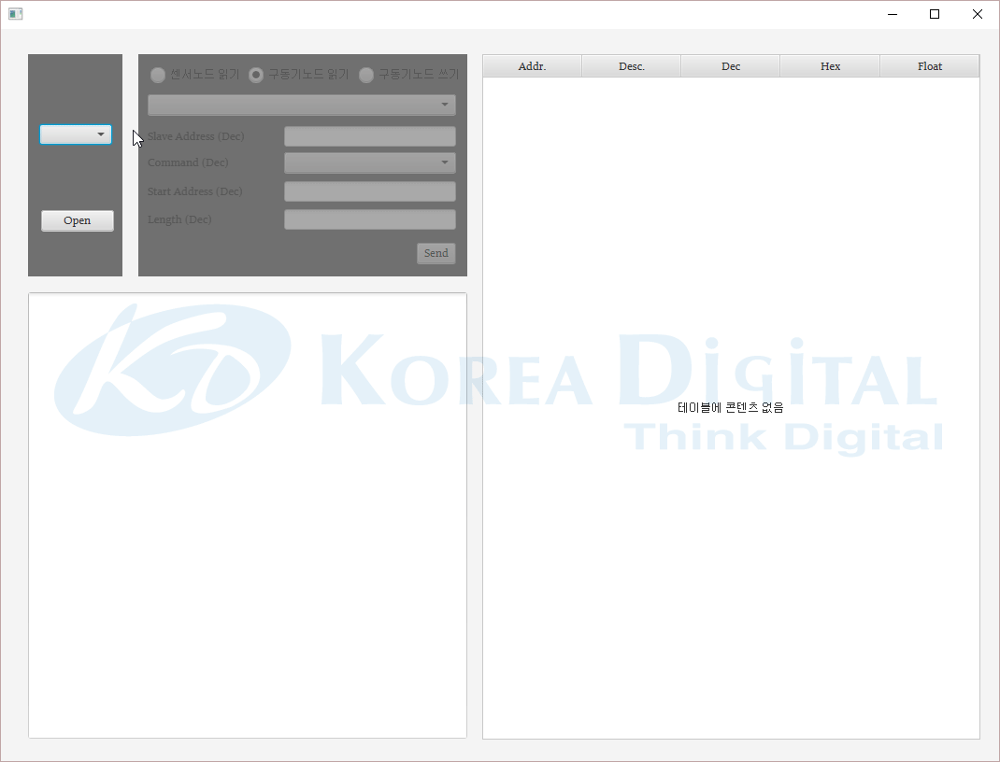

## 시작하기

이 코드는 VisualStudio Code(VS Code)에서 Java로 작성된 것입니다. 따라서 VS Code 환경에서 실행하는 것을 권장합니다.
이 앱은 JavaFX를 사용했습니다. [여기](https://gluonhq.com/products/javafx/)에서 JavaFX를 설치해 주십시오.

## 폴더 구조

workspace는 다음 두개의 폴더를 기본적으로 포함합니다.

- `src`: 메인 소스를 위한 폴더
- `lib`: 메인 종속성을 위한 폴더

## 종속성 관리

여러분의 종속성 관리를 위해 `JAVA DEPENDENCIES` view를 사용하면 됩니다. 자세한 사항은 [여기](https://github.com/microsoft/vscode-java-pack/blob/master/release-notes/v0.9.0.md#work-with-jar-files-directly)에서 확인할 수 있습니다.
VS Code에서 앱을 실행하면 .vscode 폴더와 그 아래에 launch.json, setting.json이 생성될 것입니다.
launch.json을 열어 아래의 코드를

    "vmArgs": "--module-path=%JAVAFX_SDK_LIBRARY%  --add-modules=ALL-MODULE-PATH",

아래의 줄 밑에 입력하고 저장해주십시오.
%JAVAFX_SDK_LIBRARY%는 설치한 JavaFX의 lib의 절대경로입니다.
```
"name": "Launch App",
"name": "Launch Current File",
```

## 애플리케이션 설명
1. RS485통신을 하는 구동기노드또는 센서노드를 USB로 Windows 컴퓨터에 연결합니다.
2. Win키 + Pause Break키 > 장치 관리자 또는 Win키 + X키 > 장치 관리자 를 눌러 장치관리자에서 연결한 장치가 몇번 포트에 연결됐는지 확인합니다.
3. 애플리케이션을 실행하고 좌측상단의 콤보박스에서 방금 연결한 장치를 선택하고 Open 버튼을 클릭합니다.
4. 노드가 연결되면 오른쪽의 패널이 활성화됩니다. 연결한 노드를 클릭합니다.
5. 콤보박스에서 실행할 기능을 선택합니다. 그러면 자동으로 하단의 내용들이 입력됩니다. 이는 사용자가 임의의 값을 입력할 수도 있습니다.
6. Send 버튼을 클릭하면 하단에 보낸 메세지에 대한 받은 메세지를 표시하고 우측의 패널에 그 메세지를 표 형식으로 보여줍니다.

## 스크린샷


## Q&A

    Error: JavaFX runtime components are missing, and are required to run this application
    
이 에러는 launch.json 파일에 JavaFX lib 경로가 제대로 입력되지 않은 것입니다.