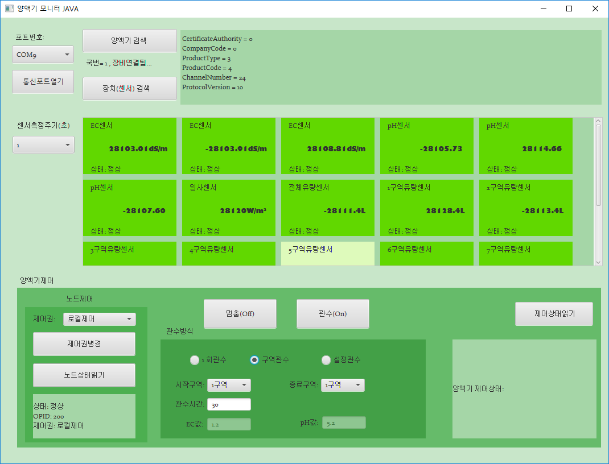

## Getting Started

양액기노드 예제 프로그램입니다.
디폴트맵사용

## Folder Structure

The workspace contains two folders by default, where:

- `src`: the folder to maintain sources
- `lib`: the folder to maintain dependencies

## Dependency Management

The `JAVA DEPENDENCIES` view allows you to manage your dependencies. More details can be found [here](https://github.com/microsoft/vscode-java-pack/blob/master/release-notes/v0.9.0.md#work-with-jar-files-directly).

## Screenshot
