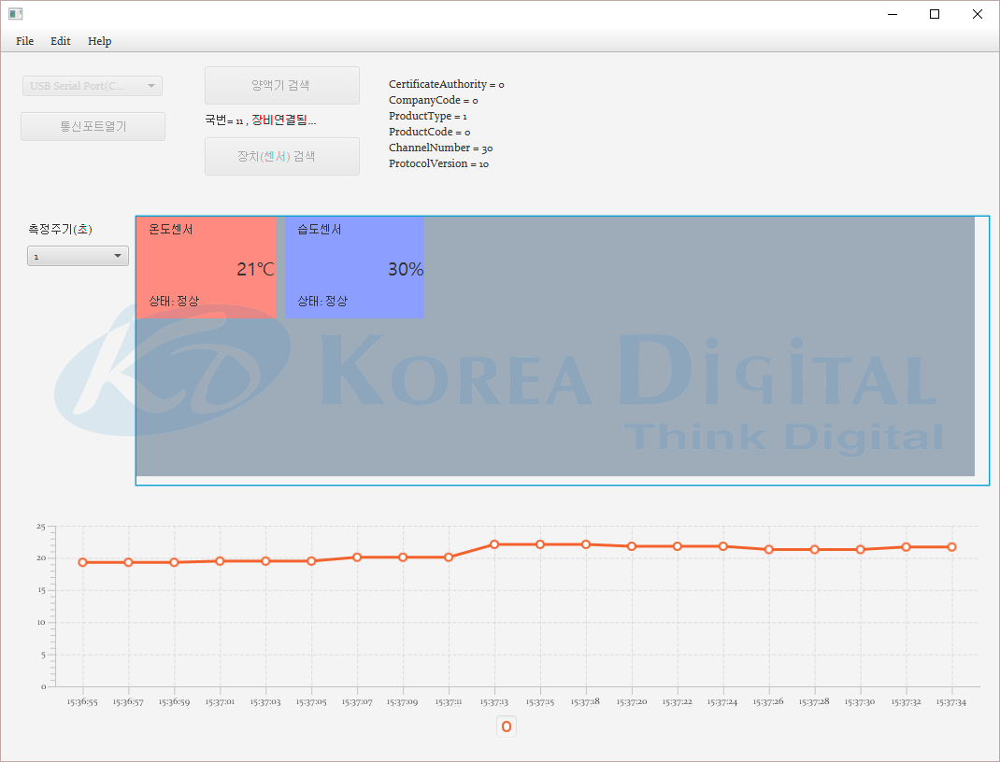

## 시작하기

이 코드는 VisualStudio Code(VS Code)에서 Java로 작성된 것입니다. 따라서 VS Code 환경에서 실행하는 것을 권장합니다.
이 앱은 JavaFX를 사용했습니다. [여기](https://gluonhq.com/products/javafx/)에서 JavaFX를 설치해 주십시오.


## 폴더 구조

workspace는 다음 두개의 폴더를 기본적으로 포함합니다.

- `src`: 메인 소스를 위한 폴더
- `lib`: 메인 종속성을 위한 폴더

## 종속성 관리

여러분의 종속성 관리를 위해 `JAVA DEPENDENCIES` view를 사용하면 됩니다. 자세한 사항은 [여기](https://github.com/microsoft/vscode-java-pack/blob/master/release-notes/v0.9.0.md#work-with-jar-files-directly)에서 확인할 수 있습니다.
VS Code에서 앱을 실행하면 .vscode 폴더와 그 아래에 launch.json, setting.json이 생성될 것입니다.
launch.json을 열어 아래의 코드를

    "vmArgs": "--module-path=%JAVAFX_SDK_LIBRARY%  --add-modules=ALL-MODULE-PATH",

아래의 줄 밑에 입력하고 저장해주십시오.
%JAVAFX_SDK_LIBRARY%는 설치한 JavaFX의 lib의 절대경로입니다.
```
"name": "Launch App",
"name": "Launch Current File",
```

## 애플리케이션 설명
1. RS485통신을 하는 센서노드를 USB로 Windows 컴퓨터에 연결합니다.
2. Win키 + Pause Break키 > 장치 관리자 또는 Win키 + X키 > 장치 관리자 를 눌러 장치관리자에서 연결한 장치가 몇번 포트에 연결됐는지 확인합니다.
3. 애플리케이션을 실행하고 좌측상단의 콤보박스에서 방금 연결한 장치를 선택하고 통신포트열기 버튼을 클릭합니다.
4. 센서노드가 연결되면 오른쪽의 양액기 검색 버튼이 활성화됩니다. 양액기 검색 버튼을 클릭합니다.
5. 검색이 정상적으로 완료되면 양액기 검색 버튼 밑에 '국번=xx, 장비연결됨...' 이라는 문구와 함께 오른쪽에 센서노드의 기본 정보들이 보입니다.
6. 활성화된 장치(센서)검색 버튼을 누르면 센서노드밑에 연결된 Slave를 검색해 센서를 찾습니다.
7. 찾은 센서들이 하단 청색 공간에 각각 패널에 넣어진 상태로 보입니다. 이 상태에서는 아직 센서값을 조회하지 않습니다.
8. 측정주기(초) 밑에 콤보박스에서 새로고침할 주기를 선택하면 그 주기마다 순차적으로 검색한 센서의 값을 조회합니다.
9. 각 센서패널을 클릭하면 조회한 값으로 만들어진 그래프가 하단에 보이게 됩니다.

## 스크린샷
