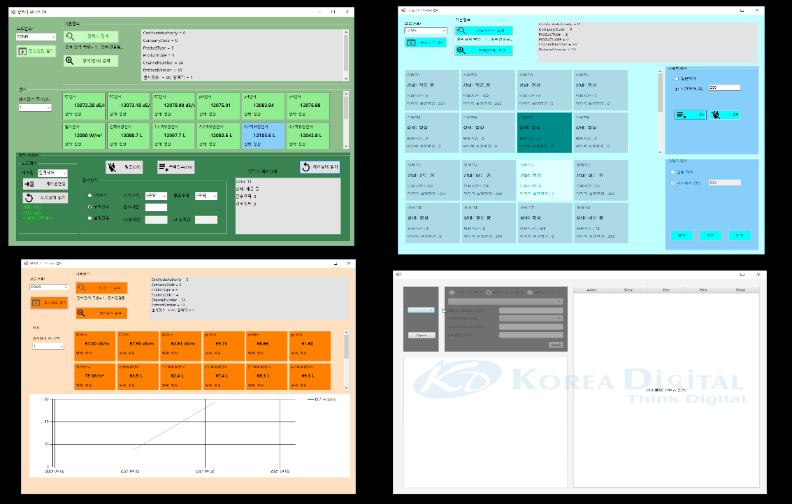

# KSx3267framework

KSX-3267 스마트온실 센서/구동기 노드 및 온실 통합제어기 간 인터페이스를 위한 프레임 워크입니다.


- RS485 Modbus RTU 통신프로토콜 지원
- SDK 지원
- 메타데이터및 Json 직렬화 지원
- 윈도우용 예제 프로그램 포함
- 유틸리티 지원


## Folder Structure


- `C_sharp`: .net Framework C# 용 소스
- `Docs`: SDK  도움말
- `Embedded`: 임베디드 시스템용 C  소스
- `Java`: JAVA 소스
- `Json`: 디폴트노드에 대한 메타데이터 json 파일


## <a name="charp_rtu"></a>C# RS485 Modbus example

```rust

    STDModbusMaster mRTUMaster = new STDModbusMaster();
    if (mRTUMaster.Open(1, 9600) == true)
    {
        //레지스터 1번 주소에서 8개 데이터를 읽어옴.
        STDModbusResponse rv = mModbusMaster.StandardWordRead_F3(1, 1, 8, 1000);
        if (rv != null && rv.rep_function == MDFunction.MODBUS_FC_READ_HOLDING_REGISTERS)
        {
            foreach(int readv in rv.wordDatas)
            {
                Debug.WriteLine("Read: " + readv);
            }
            return true;
        }
    }

```


## <a name="charp_rtu"></a>C# SDK example

```rust

    STDModbusMaster mRTUMaster = new STDModbusMaster();

    if (mRTUMaster.Open(1, 9600) == true)
    {
        //센서노드를 생성함.
        SensorNode mSensorNode = new SensorNode(11, mRTUMaster);
         if (mSensorNode.ReadNodeInformation() == true)
         {

         }

        // 센서노드에 연결된 장치코드를 읽어옴.
         if (mSensorNode.ReadDeviceCodeList() == true)
        {
            //연결된 센서의 객체를 생성함(메타데이터 포함).
            if (mSensorNode.CreateDevices() == true)
            {
                foreach (SensorDev ms in mSensorNode.mSensorDevices)
                {
                    //센서상태및 센서 값을 읽어옴.
                     if (mSensorNode.readDeviceStatus(ms) == true)
                    {
                        Debug.WriteLine("Read Sensor: " + ms.value);
                    }
                }

            }
        }
    }

```


## ScreenShot
